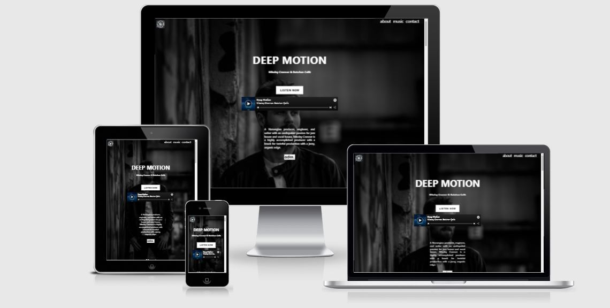
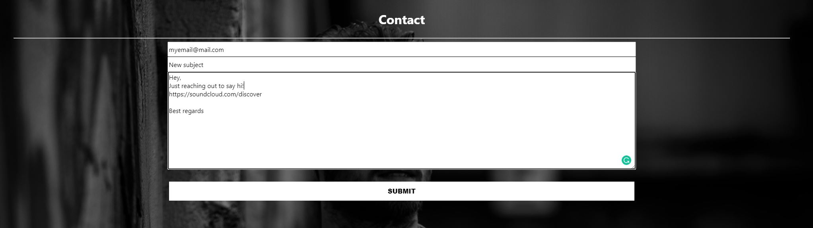
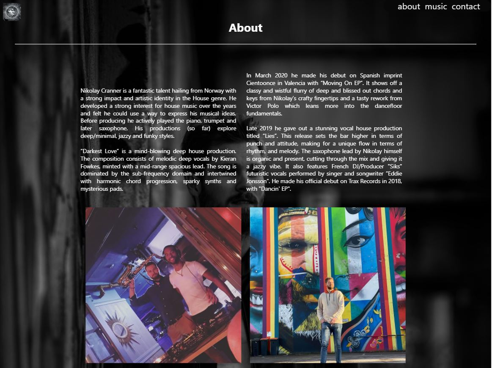
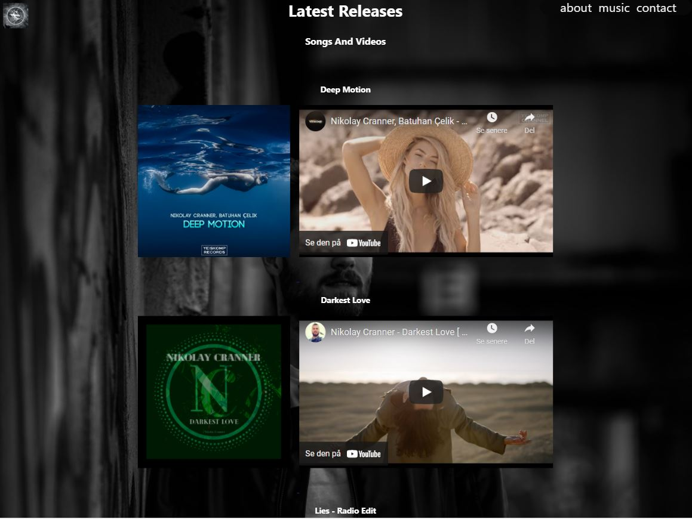

<h1 align="center">Nikolay Cranner - Artistpage</h1>

[View the live project here.](https://nno24.github.io/javascript-p02/)

This is the official artistpage for Nikolay Cranner. It is designed to be responsive and accessible on a range of devices, making it easy to navigate for existing/potential fans and business persons.

<h2 align="center">
    
</h2>

## User Experience (UX)
  ## Epic
  As a user I want to easily and efficiently learn more, browse or purchase from, and get in touch with the artist.
-   ### User stories

    -   #### New potential/existing fan

        1. I want to easily and efficiently follow the artist by accessing the social media links.
        2. I want to easily and efficiently learn more about the artist.
        3. I want to easily and efficiently browse and/or purchase the artist's contents.
        4. I want to easily and efficiently get in touch with the artist for booking inqueries.

    -   #### New potential business person

        1. I want to easily and efficiently follow the artist by accessing the social media links.
        2. I want to easily and efficiently learn more about the artist.
        3. I want to easily and efficiently browse the artist's contents.
        4. I want to easily and efficiently get in touch with the artist for business inqueries.


-   ### Design
    -   #### Colour Scheme
        -   The three main colours used are white, grey and black.
            Embedded media elements and pictures have original color.
    -   #### Typography
        -   The Apple-system font is the main font used throughout the whole website with BlinkMacSystemFont as the fallback font in case for any reason the font isn't being imported into the site correctly. Apple-system is a clean font used frequently in web design, so it is both attractive and appropriate.
    -   #### Imagery
        -   The background image of the artist creates a modern contrast with the foreground elements and a cathy vibe. The fallback background color is set to rbg(27,27,27).
        The other images used througout the page are pictures of the artist and cover art pictures
        used for his songs.

        #### Media
        -  The media elements used thorughout the page, songs and videos, are mostly embedded elements from streaming platforms and online stores. It creates an efficient and easy way
        for a user to browse or purchase the artist's contents.

        #### Social Media
        -  The footer has all social media links with icons making it easy for the user to click
        and follow.
    <h2 id="wireframes"></h2>
-   ### Wireframes/Mockup
-   The desktop version of the mockup can be found [here](assets/wireframes/desktop_full.png)
-   The mobile version of the mockup can be found [here](assets/wireframes/mobile_full.png)


## Features

-   Fully interactive contact form with greeting message when the form is submitted. 

-   The contact form have input validation, and the visitor will get an auto reply to their email.

<h2 align="center">
    
    
</h2>


-   Responsive on all device sizes

-   Interactive elements

-   Media contents, music and video, are playable directly on the page

-   Cover art's representing songs are clickable, and will take you to the song on a streaming platform
-   Home button is the artist logo on the top left, when clicking this it will take you to the
top of the page. It is visible all time, to make it easy for the user to move to the top.
-   Navigation bar is hidden in mobile view, but visible for tablet and desktop
<h2 align="center">
    
    
</h2>


## Features to be added/fixed
-   Make images under “About” section smaller, becomes too big on desktop.
-   Make the social media links more accesible.
-   Indicate on the cover arts that they are clickable.
-   When cover art is clicked, add a selection dialogue for the user to select preferred platform.
-   Add more songs and videos to “Music” section
-   Add more items for purchase, then add another section called “store”.
-   Add funding/support option for volunteers/fans.
-   Add calendar with live shows, own section.
-   Add artistic animation to give the page a more dynamic feel.
-   Add scrolling hint, so that the user is informed the webpage has more content and need to be scrolled.

## Technologies Used

### Languages Used

-   [HTML5](https://en.wikipedia.org/wiki/HTML5)
-   [CSS3](https://en.wikipedia.org/wiki/Cascading_Style_Sheets)
-   [JavaScript](https://www.javascript.com/about)

### Frameworks, Libraries & Programs Used
1. [EmailJs](https://www.emailjs.com/)
    -EmailJs was used for interactivity on the contact form. Specifically to forward the contact form when submitted to a real email address.
    Also to genereate auto replies back to the sender when contact form was submitted.
1. [Hover.css:](https://ianlunn.github.io/Hover/)
    - Hover.css was used on the navigation menu.
11. [Git](https://git-scm.com/)
    - Git was used for version control by utilizing the Gitpod terminal to commit to Git and Push to GitHub.
1. [GitHub:](https://github.com/)
    - GitHub is used to store the projects code after being pushed from Git.
1. [GitPod:](https://gitpod.io/)
    - GitPod is used as the IDE for the project.
1. [Figma:](https://figma.com/)
    - Figma was used to create the [wireframes](#wireframes) during the design process.
1. [Chrome-DevTools:](https://developer.chrome.com/docs/devtools/)
    - Chrome DevTools was used to test responsiveness on all devices,to inspect html/css, and to debug the application.
1.  [Am I Responsive?](http://ami.responsivedesign.is/)
    - Am I Responsive? was used to create the screenshot of the website for all devices, the first image of the README.


## Testing

The W3C Markup Validator, W3C CSS Validator, and JSHint JavaScript Validator Services were used to validate every page of the project to ensure there were no syntax errors in the project.

-   [W3C Markup Validator](https://jigsaw.w3.org/css-validator/#validate_by_input) - [Results](assets/validation/html-val.JPG)
-   [W3C CSS Validator](https://jigsaw.w3.org/css-validator/#validate_by_input) - [Results](assets/validation/css-val.JPG)
-   [JSHint JavaScript Validator](https://jshint.com/) - [Results](assets/validation/jshint.JPG)

### Testing User Stories from User Experience (UX) Section

-   #### New potential/existing fan

    1. I want to easily and efficiently follow the artist by accessing the social media links.
        1. The user can easally access the artists social media in the footer. However this can be enhanced, because you have to scroll all the way down to the bottom of the page.
    2. I want to easily and efficiently learn more about the artist.
        1. The user can easily and efficiently learn more about the artist by selecting "About" from the navigation menu, or by scrolling half page.
    3. I want to easily and efficiently browse and/or purchase the artist's contents.
        1. The user can easily and efficiently  browse and/or purchase content from the "Music" section, either by scrolling or by selecting "Music" from the navigation.
    4. I want to easily and efficiently get in touch with the artist for booking inqueries.
        1. The user can easily and efficiently get in touch with the artist by selecting "Contact" from the navigation menu, or by scrolling down to the bottom of the page.

-   #### New potential business person

    1. I want to easily and efficiently follow the artist by accessing the social media links.
        1. The user can easally access the artists social media in the footer. However this can be enhanced, because you have to scroll all the way down to the bottom of the page.
    2. I want to easily and efficiently learn more about the artist.
        1. The user can easily and efficiently learn more about the artist by selecting "About" from the navigation menu, or by scrolling half page.
    3. I want to easily and efficiently browse the artist's contents.
        1. The user can easily and efficiently  browse content from the "Music" section, either by scrolling or by selecting "Music" from the navigation.
    4. I want to easily and efficiently get in touch with the artist for business inqueries.
        1. The user can easily and efficiently get in touch with the artist by selecting "Contact" from the navigation menu, or by scrolling down to the bottom of the page.
 
### Further Testing

-   The Website was tested on Google Chrome, Vivaldi, Microsoft-Edge, Internet Explorer and Firefox .
-   The website was viewed on a variety of devices such as Desktop, Laptop, iPhone10 X, Huawei P20 Pro, iPhone5, iPad and iPad pro.
-   A large amount of testing was done to ensure that all pages were linking correctly.
-   Friends and family members were asked to review the site and documentation to point out any bugs and/or user experience issues.

### Known Bugs

-   During test sessions, it was observed that the "home button", which is the artist logo in the top left, was not taking the page back to top. This was observed on chrome, but saw it rarely.

## Deployment

### GitHub Pages

The project was deployed to GitHub Pages using the following steps...

1. Log in to GitHub and locate the [GitHub Repository](https://github.com/nno24/javascript-p02)
2. At the top of the Repository (not top of page), locate the "Settings" Button on the menu.
    - Alternatively Click [Here](https://raw.githubusercontent.com/) for a GIF demonstrating the process starting from Step 2.
3. Scroll down the Settings page until you locate the "GitHub Pages" Section.
4. Under "Source", click the dropdown called "None" and select "Master Branch".
5. The page will automatically refresh.
6. Scroll back down through the page to locate the now published site [link](https://github.com/nno24/javascript-p02) in the "GitHub Pages" section.

### Forking the GitHub Repository

By forking the GitHub Repository we make a copy of the original repository on our GitHub account to view and/or make changes without affecting the original repository by using the following steps...

1. Log in to GitHub and locate the [GitHub Repository](https://github.com/nno24/javascript-p02)
2. At the top of the Repository (not top of page) just above the "Settings" Button on the menu, locate the "Fork" Button.
3. You should now have a copy of the original repository in your GitHub account.

### Making a Local Clone

1. Log in to GitHub and locate the [GitHub Repository](https://github.com/nno24/javascript-p02)
2. Under the repository name, click "Clone or download".
3. To clone the repository using HTTPS, under "Clone with HTTPS", copy the link.
4. Open Git Bash
5. Change the current working directory to the location where you want the cloned directory to be made.
6. Type `git clone`, and then paste the URL you copied in Step 3.

```
$ git clone https://github.com/nno24/javascript-p02
```

7. Press Enter. Your local clone will be created.

```
$ git clone https://github.com/nno24/javascript-p02
> Cloning into `CI-Clone`...
> remote: Counting objects: 10, done.
> remote: Compressing objects: 100% (8/8), done.
> remove: Total 10 (delta 1), reused 10 (delta 1)
> Unpacking objects: 100% (10/10), done.
```

Click [Here](https://help.github.com/en/github/creating-cloning-and-archiving-repositories/cloning-a-repository#cloning-a-repository-to-github-desktop) to retrieve pictures for some of the buttons and more detailed explanations of the above process.

## Credits
1. Nikolay Cranner's artwork and media/music.
2. Friends and family for critical feedback during review.
3. Coding ideas on how to validate input fields for the contact form [here](https://www.w3schools.com/js/js_validation.asp)

### Code

-   The about pictures of the artist came from [Instagram](https://www.instagram.com/nikolay_cranner/)

-   The embedded videos came from [Youtube](https://www.youtube.com/channel/UC5ntUYnW40FCXeuowJYUOPw)

-   The embedded music for purchase came from [Beatport](https://www.beatport.com/artist/nikolay-cranner/709007)

-   The embedded music for streaming came from [Spotify](https://open.spotify.com/artist/4NvkvOJ0mDM7QjdzOZLDRd?si=QshNNTHJQRab-LCm2i6Osw&dl_branch=1)

### Content

-   All content was written by the developer.

### Media

- Proprietary images and logo was used with acceptance from Nikolay Cranner.

### Acknowledgements

-   My Mentor [Precious Ijege](https://www.linkedin.com/in/precious-ijege-908a00168/?originalSubdomain=ng) for continuous helpful feedback.

-   Tutor support at Code Institute for their support.
